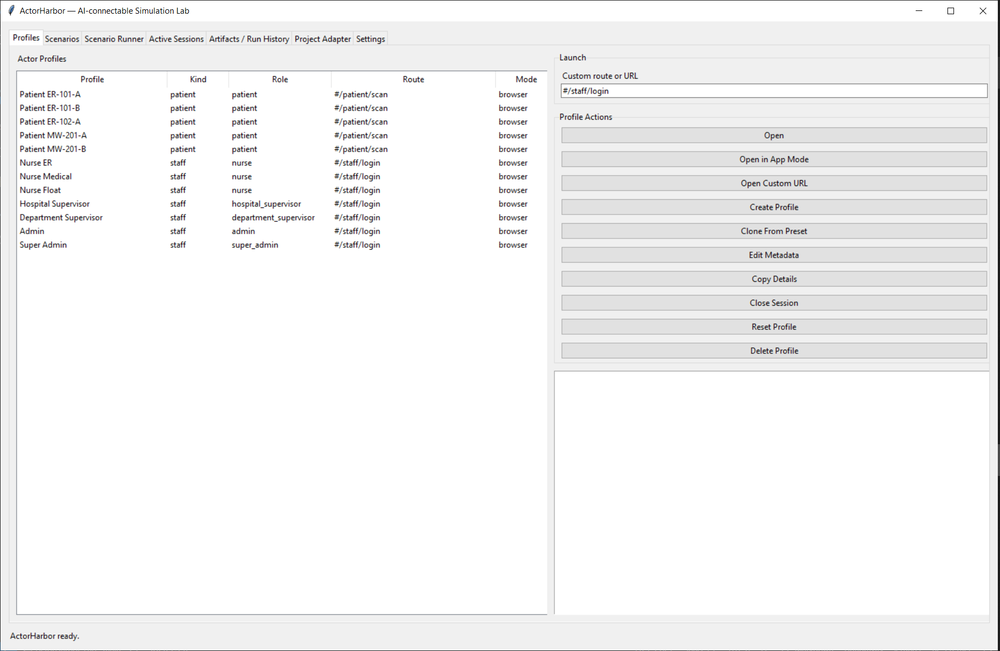
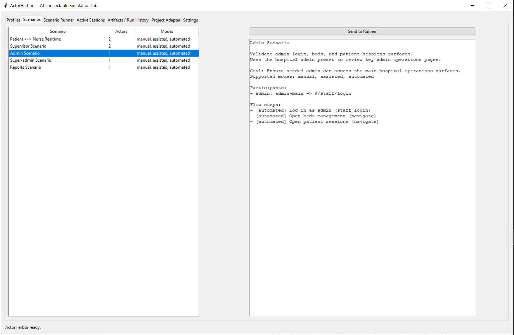
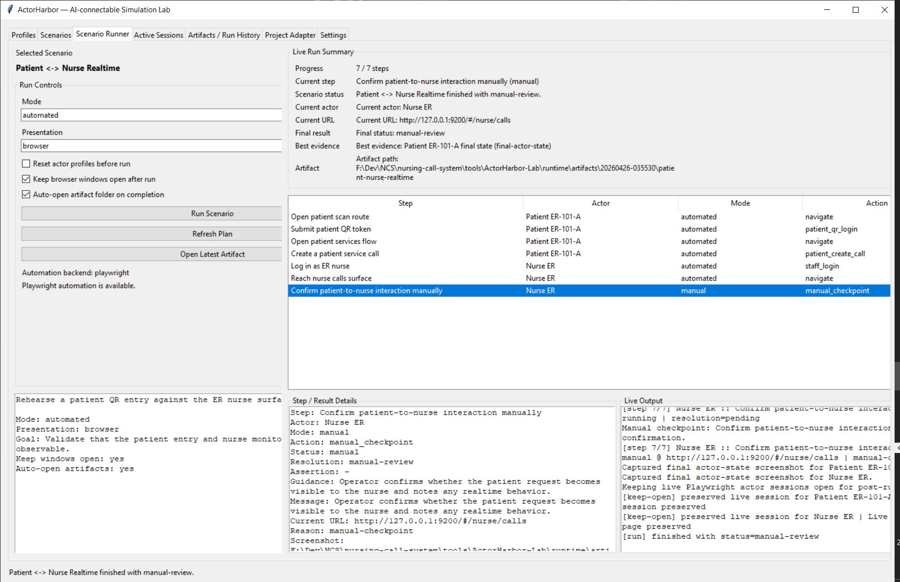
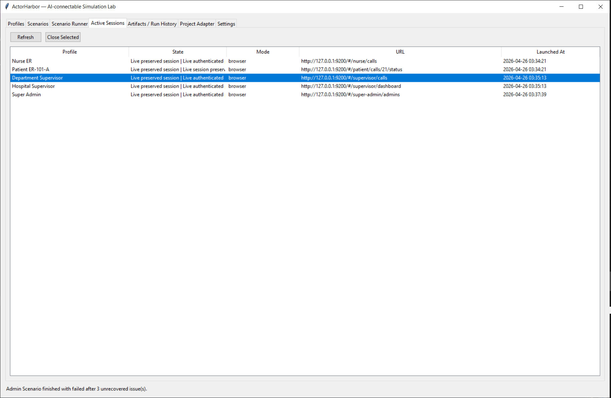
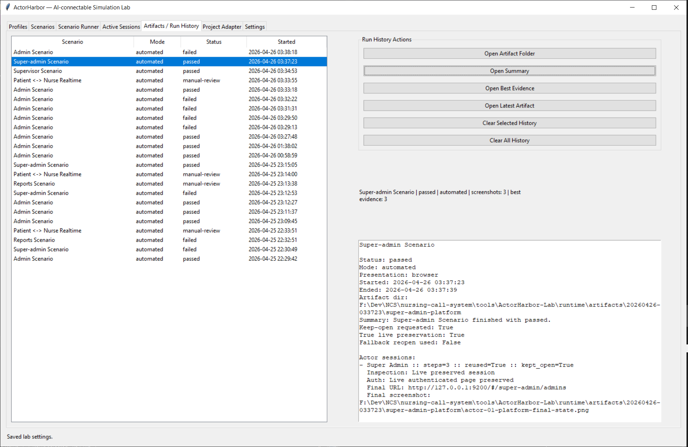
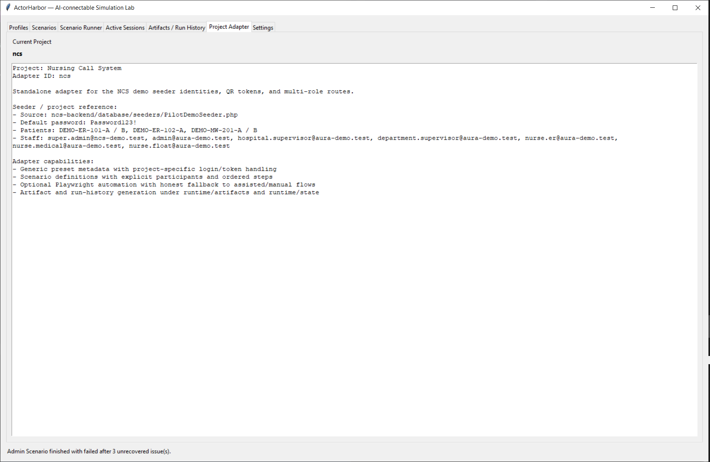
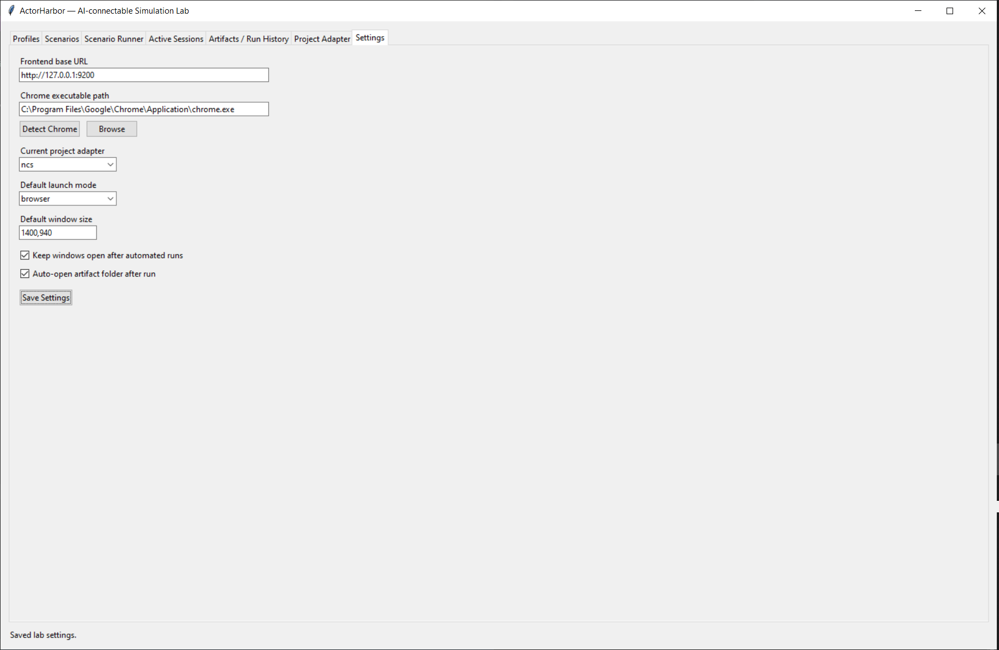

# ActorHarbor

**ActorHarbor — AI-connectable simulation lab for browser workflows and acceptance testing**

ActorHarbor is a desktop operator console for running realistic browser workflows with multiple actors, isolated browser state, evidence capture, and honest hybrid automation. It is designed for acceptance-style testing where screenshots, logs, summaries, and manual-review checkpoints matter as much as the final status.

Maintained by `AliBakrOfficial`.

## What problem ActorHarbor solves

Many browser workflows are not a single clean happy path. They often involve:

- multiple roles with separate sessions
- protected routes and redirects
- partial automation plus human checkpoints
- evidence that needs to be reviewed after the run

ActorHarbor makes those flows runnable, inspectable, and documentable without pretending every step should be a brittle fully automated test.

## Key capabilities

- multi-actor scenario execution with isolated Chrome profiles
- desktop UI for launching, observing, and reviewing runs
- automated, assisted, and manual modes
- Playwright-backed browser automation
- truthful keep-open behavior and live inspection labeling
- run artifacts with summaries, logs, screenshots, and evidence indexes
- adapter-driven project support
- AI-friendly adapter authoring path for new projects

## Quick start

### Install

```powershell
cd tools\ActorHarbor-Lab
python -m venv .venv
.\.venv\Scripts\python.exe -m pip install -r requirements-playwright.txt
.\.venv\Scripts\python.exe -m playwright install chromium
```

### Launch the UI

```powershell
cd tools\ActorHarbor-Lab
.\run-local-saas-lab.bat
```

This launcher path is the default Windows entry point and remains supported.

You can also launch directly with:

```powershell
python run_lab.py
```

### Run one scenario from CLI

```powershell
cd tools\ActorHarbor-Lab
.\.venv\Scripts\python.exe .\run_scenario.py admin-operations --mode automated --launch-mode browser
```

## UI overview

ActorHarbor is organized as a multi-tab desktop tool:

- `Profiles`
  - create, inspect, clone, reset, and launch actor profiles
- `Scenarios`
  - browse scenario definitions and send one to the runner
- `Scenario Runner`
  - choose mode, start a run, watch live progress, and review final status
- `Active Sessions`
  - inspect live or preserved sessions and understand actor/window state
- `Artifacts / Run History`
  - review previous runs, open artifacts, and manage history safely
- `Project Adapter`
  - inspect the active adapter, selectors, routes, and project-specific mapping
- `Settings`
  - configure base URL, Chrome path, defaults, and runner behavior

For a fuller walkthrough, see [User Guide](./docs/USER_GUIDE.md).

## Screenshots

### Profiles and Scenarios





### Scenario Runner



### Active Sessions and Artifacts





### Project Adapter and Settings





See [Screenshot Guide](./docs/SCREENSHOTS.md) for the current screenshot set and future refresh guidance.

## How it works

At a high level, ActorHarbor combines:

- a reusable core execution engine
- a project adapter that describes routes, selectors, auth rules, and scenarios
- an operator-facing desktop UI
- artifact generation for screenshots, summaries, and logs

The tool stays honest about what was automated, what was skipped because it was already satisfied, and what still needs manual review.

## AI-connectable and adapter-driven

ActorHarbor is adapter-driven by design. An adapter can define:

- routes and route intent
- actor roles and presets
- login strategy and protected-surface detection
- selectors and stable end-state signals
- settle hints and evidence hints
- manual-review boundaries

That makes the tool a practical target for AI-assisted adapter authoring: an AI agent can inspect a project, propose selectors and route mappings, and generate adapter definitions without changing the generic core.

Start here:

- [Adapter Contract](./docs/ADAPTER_CONTRACT.md)
- [AI-Agent Adapter Generation Guide](./docs/AI_ADAPTER_AUTHORING.md)
- [NCS Example Adapter](./examples/ncs/README.md)

## Main docs

- [Getting Started](./docs/GETTING_STARTED.md)
- [User Guide](./docs/USER_GUIDE.md)
- [Usage Guide](./docs/USAGE.md)
- [Architecture Overview](./docs/ARCHITECTURE.md)
- [Adapter Model](./docs/ADAPTER_MODEL.md)
- [Adapter Contract](./docs/ADAPTER_CONTRACT.md)
- [AI-Agent Adapter Generation Guide](./docs/AI_ADAPTER_AUTHORING.md)
- [Artifacts And Evidence](./docs/ARTIFACTS_AND_EVIDENCE.md)
- [Trust Model And Troubleshooting](./docs/TRUST_MODEL_AND_TROUBLESHOOTING.md)
- [Development Guide](./docs/DEVELOPMENT.md)

## Current limitations

ActorHarbor is technically strong, but it is not magic:

- adapters are still the project-specific layer
- not every workflow should be fully automated
- some scenarios are intentionally hybrid and end in `manual-review`
- screenshot quality depends on the configured environment and the adapter's settle hints
- local environment setup still matters for Chrome, Playwright, and reachable app URLs

## Public project identity

- public project name: `ActorHarbor`
- public repository maintainer: `AliBakrOfficial`
- current repository shape: standalone tool repo, not tied to changing product runtime code

## Development and validation

Run tests:

```powershell
cd tools\ActorHarbor-Lab
python -m unittest discover -s tests
```

Compile-check key modules:

```powershell
cd tools\ActorHarbor-Lab
python -m py_compile .\run_lab.py .\run_scenario.py .\lab\app.py .\lab\scenario_runner.py .\lab\run_history.py .\lab\automation\engine.py
```

## License

MIT. See [LICENSE](./LICENSE).
